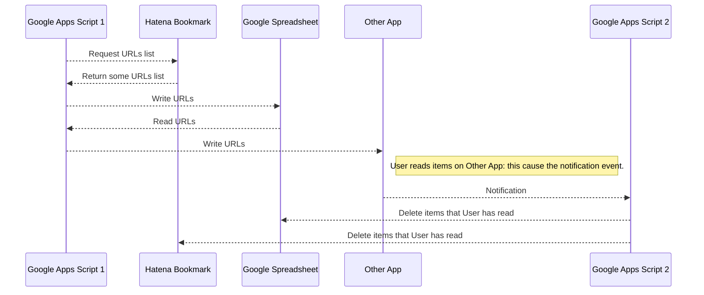

# RIL-clean-helper
はてなブックマークの「あとで読む」アイテムをクリーンにするためのヘルパーツールです。

## Motivation
はてなブックマーク(以下、はてブ)での「あとで読む」ブックマーク数があまりに多く、別アプリ(ex. Pocket)などで管理したい

## Sequence

```mermaid
sequenceDiagram
Google Apps Script 1 -->> Hatena Bookmark: Request URLs list
Hatena Bookmark -->> Google Apps Script 1: Return some URLs list
Google Apps Script 1-->>Google Spreadsheet: Write URLs
Google Spreadsheet-->>Google Apps Script 1: Read URLs
Google Apps Script 1-->>Other App: Write URLs
Note right of Other App: User reads items on Other App: this cause the notification event.
Other App-->>Google Apps Script 2:Notification
Google Apps Script 2-->>Google Spreadsheet: Delete items that User has read
Google Apps Script 2-->>Hatena Bookmark: Delete items that User has read
```
