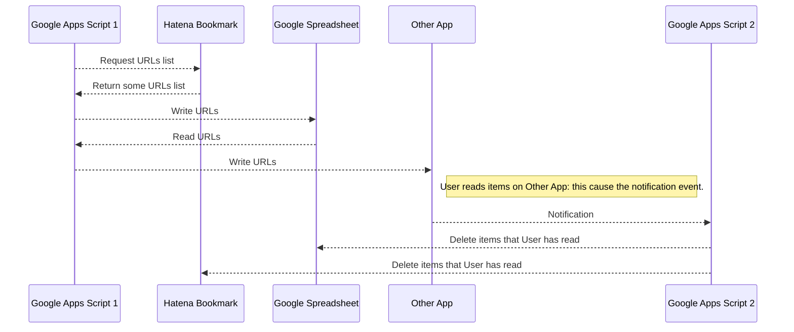

# RIL-clean-helper
はてなブックマークの「あとで読む」アイテムをクリーンにするためのヘルパーツールです。

## Motivation
はてなブックマーク(以下、はてブ)での「あとで読む」ブックマーク数があまりに多く、別アプリ(ex. Pocket)などで管理したい

## HowToUse
1. G Suiteから新規スプレッドシートを作成し、空のワークシートを2つ用意する
1. スプレッドシートのメニューから「ツール」→「スクリプトエディタ」を選択し、スクリプトエディタを開く
1. スクリプトエディタで、本プロジェクトの.gsファイルを全てコピーする
1. はてブのブックマークを取得し、スプレッドシートのワークシートに出力するコードを作成する
    1. スクリプトエディタのメニューから「ファイル」→「新規作成」→「スクリプトファイル」を選択し、新規スクリプトファイルを作成する
    1. 新規スクリプトファイルで、outputListMain()をコールする新規メソッドを追加する
    1. 1.で追加したメソッドで、outputListMain()をコールする前に以下のプロパティを設定するコードを追加する　　
    プロパティの設定は、Properties.getScriptProperties.setProperty(key, value)メソッドを使用する
        * hatebu_username: はてブのユーザアカウントID
        * hatebu_tag: 取得するブックマークのタグ(ex.あとで読む)
        * hatebu_fetch_size: 取得するブックマークの数
        * spreadsheet_id: スプレッドシートのID

## Sequence

